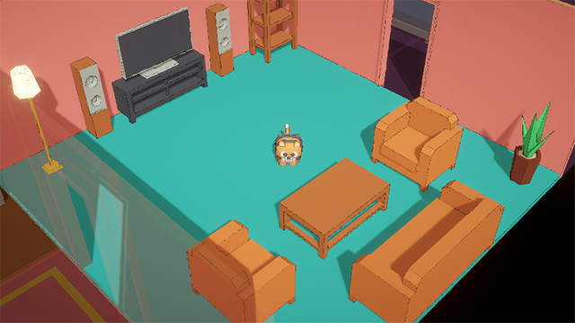

# mini-agent-unity
A simple Unity scene featuring a tiger character navigating an isometric 3D environment with a kitchen, living room, and bedroom.

## 🛠 Environment & Settings
* **Unity Version:** 6000.5.5f1
* **Render Pipeline:** URP (Universal Render Pipeline)

## 🎮 Scene Description (Features)
* Implemented a simple isometric 3D space consisting of a kitchen, living room, and bedroom.
* **Controls:** Use the `W`, `A`, `S`, `D` keys on your keyboard to move the Tiger character in four directions.

## 📦 Assets Used
This project was created using assets from Kenney.nl.
* [Furniture Kit](https://kenney.nl/assets/furniture-kit) - Environment and furniture composition
* [Cube Pets](https://kenney.nl/assets/cube-pets) - Tiger character model